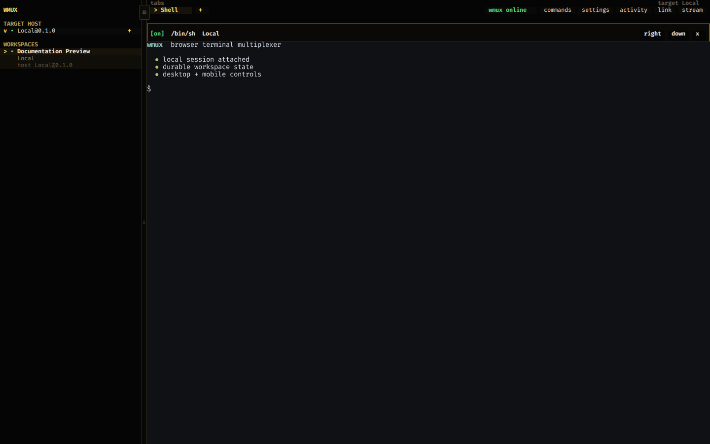
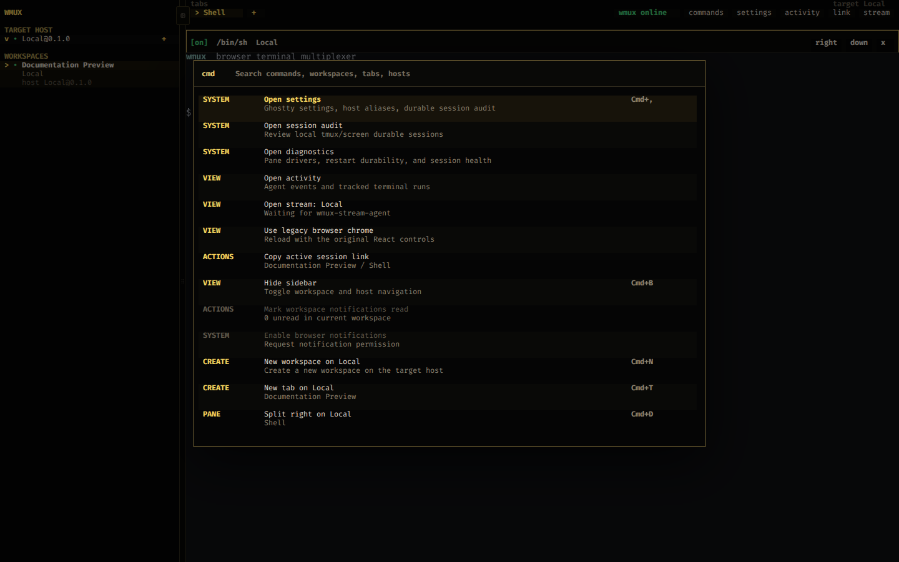
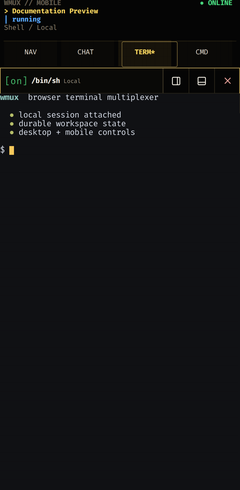
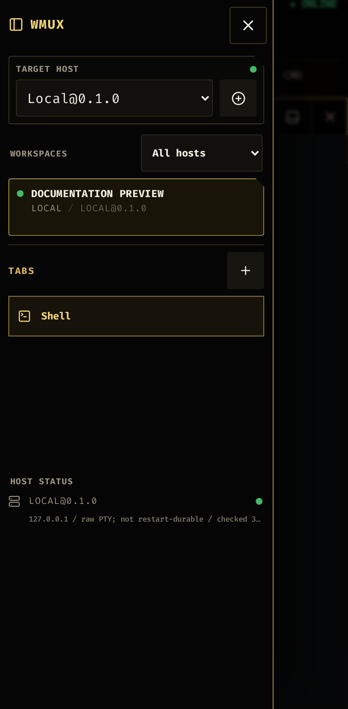
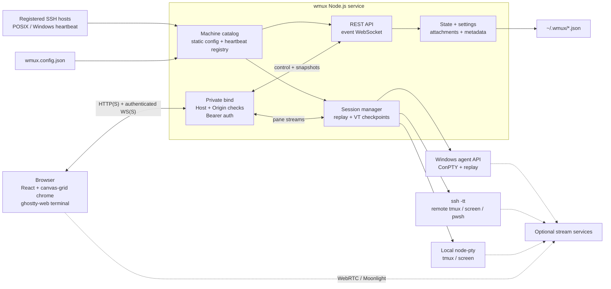

# wmux

A single-user browser terminal multiplexer for a Tailscale or internal network.

wmux combines:

- PTY and durable-session ownership behind authenticated WebSockets,
- cmux-style workspaces, tabs, splits, activity, and direct links,
- `ghostty-web` terminal rendering with desktop and mobile browser chrome,
- local, SSH, PowerShell-over-SSH, and experimental Windows-agent backends,
- dynamic host heartbeats plus browser-aware clipboard, media, and notifications.

> [!CAUTION]
> A public source repository does not make the running service suitable for the
> public Internet. wmux grants terminal access to its host machines and is
> designed for one trusted user behind loopback, Tailscale, or another private
> network boundary. Do not publish it through a public bind or an unrestricted
> reverse proxy.

## Screenshots

### Desktop





### Mobile

<p>
  
  
</p>

The tracked screenshots are captured from the isolated local fixture with
`npm run docs:screenshots`; they do not use a live machine inventory.

## Architecture



The server owns canonical workspace state and one long-lived session client per
pane. Browsers are attachable views: closing or refreshing a browser does not
kill a pane, while explicitly closing a pane, tab, or workspace does. Local and
POSIX SSH panes can reattach through `tmux` or `screen`; the Windows agent owns
ConPTY sessions across wmux service restarts. See
[Restart Persistence](#restart-persistence) for the exact durability boundary.

## Security Model

wmux is defense-in-depth for a private network, not a hardened multi-tenant
terminal service. The server rejects wildcard and public bind addresses, checks
Host and Origin on HTTP and WebSocket requests, and authenticates control and
pane endpoints. Browser tokens are stored locally and WebSocket authentication
uses a query token; static remote helpers may receive a broadly privileged
shared token. Use HTTPS away from loopback, treat every token as a password,
and keep every API, WebSocket, helper, clipboard, media, and streaming endpoint
inside the same trusted network boundary.

## Run

```bash
npm install
npm run build
npm run start -- --host 127.0.0.1 --port 3478
```

For development, `npm run dev` serves the client through Vite with HMR. `npm run typecheck` covers the client and server TypeScript projects, and `npm test` runs the node:test suite in `test/`.

Before pushing a change, run the complete local gate:

```bash
npm run check
npm run test:e2e
```

`check` runs unit/integration tests, both TypeScript checks, script syntax checks, and the production build. Playwright starts an isolated loopback-only wmux instance with separate state, settings, attachments, and a local-only machine config, then exercises desktop Chromium plus phone-sized Chromium and WebKit flows. `npm run test:e2e:chromium` is the faster browser subset. Gitea Actions runs the full gate on pushes and pull requests.

To expose on Tailscale, bind to this machine's Tailscale IP:

```bash
npm run start -- --host 100.x.y.z --port 3478
```

The server refuses public bind hosts. Use loopback, Tailscale `100.64.0.0/10`, or an RFC1918/internal address.

For a non-root container deployment with loopback-only port publishing by
default, see [deploy/docker/README.md](deploy/docker/README.md). The Compose
stack builds directly from a checkout and keeps machine configuration, SSH
keys, environment files, and persisted state outside the image.

To serve wmux over HTTPS with a Tailscale certificate, point wmux at the certificate and key and set the public URL to the certificate name:

```bash
WMUX_CERT_FILE=~/.wmux/certs/wmux-host.tailnet.ts.net.crt \
WMUX_KEY_FILE=~/.wmux/certs/wmux-host.tailnet.ts.net.key \
WMUX_PUBLIC_URL=https://wmux-host.tailnet.ts.net:3478 \
npm run start -- --host 100.x.y.z --port 3478
```

The HTTPS top-level page is required for browser secure-context APIs used by the Moonlight desktop streaming path. Serving only the gateway over HTTPS is not enough if wmux itself is loaded over plain HTTP.

## Run As A User Service

Install and start the systemd user service:

```bash
scripts/install-user-service.sh
```

This chooses the first Tailscale IPv4 address when available. Override it with:

```bash
WMUX_HOST=100.x.y.z WMUX_PORT=3478 scripts/install-user-service.sh
```

The service installer also preserves `WMUX_CERT_FILE`, `WMUX_KEY_FILE`, and `WMUX_PUBLIC_URL` when they are set.

Useful service commands:

```bash
systemctl --user status wmux.service
systemctl --user restart wmux.service
journalctl --user -u wmux.service -f
```

Run backend-aware diagnostics against the service with `scripts/wmux-doctor`
(or `scripts/wmux-doctor --json`). The same read-only report is available from
**Diagnostics** in the command palette and shows pane drivers, restart
durability, host reachability, and durable-session issues without exposing
machine secrets.

## Configure Machines

The checkout-local runtime config is intentionally ignored by Git. Start from
the public example, or keep the config in your home directory:

```bash
cp wmux.config.example.json wmux.config.json
```

Put machine definitions in `wmux.config.json` or `~/.wmux/config.json`:

```json
{
  "machines": [
    {
      "id": "linux-box",
      "name": "Linux Box",
      "kind": "ssh",
      "host": "linux-box.tailnet-name.ts.net",
      "user": "operator"
    },
    {
      "id": "windows-box",
      "name": "Windows Box",
      "kind": "powershell-ssh",
      "host": "windows-box",
      "user": "operator"
    }
  ]
}
```

Set `WMUX_CONFIG_PATH` to use one explicit config file. When set, wmux will not fall back to the repository or home config, and startup fails if the requested file is missing. This keeps tests and alternate service instances isolated from the default machine inventory.

Do not commit a live inventory, credentials, agent tokens, gateway tokens, or
private key paths. Keep reusable examples in `wmux.config.example.json`.

wmux adds a local machine when no configured machine has the `local` ID. Set
`"localMachine": false` at the top level to suppress that implicit shell, for
example when wmux runs in a container used only as a gateway to remote hosts.

If the browser accesses wmux through a MagicDNS or reverse-proxy name that is not under `*.ts.net`, set `WMUX_ALLOWED_HOSTS` to a comma-separated allowlist.

Unix-like local and SSH machines default to `"sessionBackend": "auto"`, which attaches panes to a durable `tmux` session when available, or `screen` when `tmux` is not installed. Use `"sessionBackend": "pty"` to force the original raw PTY behavior for a machine.

Use `kind: "powershell-ssh"` for Windows hosts reachable from a non-Windows wmux server. It starts the local `ssh` client with a forced TTY and launches `pwsh -NoLogo -NoProfile` on the Windows host, so the Windows host must have PowerShell 7 and OpenSSH Server configured for the target user. Reachability for this kind requires a local `ssh` client, a TCP response on SSH port 22, and a short PowerShell health probe that reports helper and stream readiness. This path does not use WSMan or the PowerShell SSH remoting subsystem.

Legacy `kind: "powershell"` still uses `Enter-PSSession -ComputerName`, which uses WSMan remoting. Microsoft documents WSMan remoting as unsupported from non-Windows PowerShell hosts, so a Linux wmux server cannot reliably drive a Windows host that way even if `pwsh` is installed and WinRM answers on TCP 5985. Plain `powershell-ssh` panes are non-durable; to let Windows panes survive wmux service restarts, opt the machine into the Windows session agent with `"sessionBackend": "agent"` (see [Experimental Windows Session Agent](#experimental-windows-session-agent)).

For the full Windows registration checklist, see [docs/WINDOWS_NODE_REGISTRATION.md](docs/WINDOWS_NODE_REGISTRATION.md).

## Dynamic Host Registration

Remote SSH hosts may register themselves instead of requiring a static entry in
`wmux.config.json`. wmux generates a dedicated credential at
`~/.wmux/registration-token`; override it with `WMUX_REGISTRATION_TOKEN` or
`WMUX_REGISTRATION_TOKEN_PATH`. This shared credential is trusted catalog-write
authority: a holder can create or update any dynamic machine ID, but cannot
read the registry, delete hosts, or use other APIs. It remains required when
`WMUX_DISABLE_AUTH=1`; registry reads and deletes use normal wmux authorization.

Provision these files manually on each remote host:

```text
~/.wmux/url
~/.wmux/registration-token
~/.wmux/heartbeat.json
```

The URL file contains the externally reachable wmux base URL. Copy the
registration token from the wmux server over an already trusted channel and
keep both the token and JSON file mode `0600`. A POSIX SSH host can use:

```json
{
  "machine": {
    "id": "linux-box",
    "name": "Linux Box",
    "kind": "ssh",
    "user": "operator",
    "sessionBackend": "auto"
  },
  "ttlMs": 90000,
  "metadata": { "os": "linux" }
}
```

Only `ssh` and `powershell-ssh` registrations are accepted. Connection and
session fields are allowlisted; registrations cannot supply commands, service
machines, agent URLs, or stream gateway configuration. A supplied `host` is
accepted for compatibility but ignored: wmux always dials the validated source
IP of the heartbeat. For a `powershell-ssh` machine using
`"sessionBackend": "agent"`, both `agentPort` and `agentToken` are required;
the callback remains pinned to the observed source IP, and the token is removed
from registry, status, helper-bundle, and browser state responses. While a
persisted pane references an ID, its connection descriptor and agent token are
pinned but address-only roaming remains allowed. A live agent pane also pins its
address. Close the referenced panes before rotating a token or descriptor.

Send one heartbeat for validation or run continuously:

```bash
scripts/wmux-heartbeat --once
scripts/wmux-heartbeat --interval 30
```

On a systemd user host, `scripts/install-heartbeat-service.sh` installs the
shipped `wmux-heartbeat.service` and `wmux-heartbeat.timer` after the three
files above exist. The timer posts every 30 seconds. On Windows, copy
`scripts/windows/wmux-heartbeat.ps1` for initial enrollment. After a registered
pane stages the normal helper bundle through SSH bootstrap or the Windows agent,
install the per-user logon task with:

```powershell
wmux-windows-setup install-heartbeat
wmux-windows-setup heartbeat-status
wmux-windows-setup heartbeat-logs
```

The systemd timer runs in the user manager; enable lingering with
`loginctl enable-linger "$USER"` if it must run while that user is logged out.
The Windows task is intentionally per-user and triggered at logon, so the host
does not heartbeat before that user signs in.

Registrations default to a 90-second TTL (allowed range: 30 seconds through 24
hours). A missed TTL keeps the machine visible but marks it offline; records are
removed after seven days without a heartbeat unless a persisted pane still
references them. Heartbeats for the same ID must be at least five seconds apart;
the registry accepts at most 256 hosts, at most 32 from one observed address,
and at most 16 KiB of serialized metadata per host. The registry is stored at
`~/.wmux/host-registry.json`, overridable with `WMUX_REGISTRY_PATH`.

Registered panes receive staged helper commands but never the broad wmux API
token. Windows bootstrap uses a random per-machine capability that can fetch
only an inline, credential-redacted helper bundle. Helpers that post to wmux
(`wmux-notify`, `wmux-title`, `wmux-agent-event`, `wmux-run`, `wmux-media`, and
`wmux-copy`) therefore fail with `401` unless normal or suitably scoped API auth
has been provisioned separately on that trusted host. This is a current
least-privilege limitation of dynamic registration.

Live pane endpoint snapshots are process-local. Persisted panes reject descriptor
or token changes across a restart, but address-only roaming is necessarily
indistinguishable from reassignment to a different physical host with the same
descriptor. In that case wmux no longer has the old endpoint needed for
automatic durable-session cleanup; audit and remove that old remote session
manually. Ordinary address churn on the same host remains reachable.

When a reverse proxy is directly in front of wmux, list its exact IP in
`WMUX_TRUSTED_PROXIES`. wmux accepts `X-Forwarded-For` only from those peers,
validates every hop as an IP literal, and walks the chain from the right. Only
trust proxies configured to replace or append the client address reliably.
Malformed chains and callback addresses outside loopback, Tailscale, RFC1918,
or IPv6 ULA space are rejected. A trusted proxy request must contain at least
one valid untrusted client hop; direct heartbeats should leave their peer IP out
of `WMUX_TRUSTED_PROXIES`.

## Authentication

wmux gates every API and WebSocket endpoint behind a bearer token, on top of the bind-address and Host/Origin checks. There are two ways to get a token, and both are accepted on every request:

**Browser login (people).** Password login is disabled until credentials are explicitly configured. Set them with:

```bash
scripts/wmux-set-password --username you   # prompts for a new password
```

The browser then shows a login form; signing in mints a stateless, signed session token (30-day expiry) that the client stores in `localStorage`. Older installations that still contain the legacy `wmux` / `wmux` default are treated as token-only until the password is changed.

On an explicitly isolated network, set `WMUX_ALLOW_INSECURE_DEFAULT_LOGIN=1` to opt back into the legacy `wmux` / `wmux` login. The known default remains rejected unless that override is present.

Session tokens are HMAC-signed with a secret persisted to `~/.wmux/session-secret`, so they survive restarts. Deleting that file rotates the secret and logs everyone out.

**Shared token (machines).** On first start wmux also generates a static token at `~/.wmux/token` (mode `0600`) and logs a URL:

```
wmux: access requires a token. Open http://100.x.y.z:3478/?token=XXXX once per browser.
```

Opening that URL stores the token directly (skipping the login form) — handy for kiosk/bookmark use. More importantly, this static token is what non-interactive clients use: statically configured panes receive it as `WMUX_TOKEN`, so the bundled helpers authenticate automatically, and remote scripts/`curl` send `authorization: Bearer $WMUX_TOKEN`. Dynamically registered panes deliberately do not receive it; see [Dynamic Host Registration](#dynamic-host-registration). Set your own with `WMUX_TOKEN=…` (or `WMUX_TOKEN_PATH`).

To run without any token — relying solely on the network boundary, as earlier versions did — set `WMUX_DISABLE_AUTH=1`.

The optional Windows session agent and Moonlight gateway run as separate services and enforce their own tokens when configured: set a machine's `agentToken` in `wmux.config.json` for the Windows agent, and `WMUX_MOONLIGHT_GATEWAY_TOKEN` (mirrored by the machine's `stream.gatewayToken`) for the gateway. When enabling auth, provide `WMUX_TOKEN` to any `wmux-stream-agent` service so it can read the stream lease.

### Retro login startup fidelity

The randomized login screen separates historical startup behavior from the
fictional wmux loading and authentication that follows it. Macintosh System 6,
Acorn RISC OS, Atari TOS/GEM, Lisa Office System, SGI IRIX, NeXTSTEP, and OS/2
remain graphical through authentication instead of falling through to a generic
terminal. Amiga Workbench keeps its intentional Workbench-to-AmigaShell one-off,
with a bonus Guru Meditation recovery variant; MSX2 retains its native
logo-to-command-console transition. Other
text/firmware machines enter their native display immediately; brand logos are
not inserted merely because an asset exists. In particular, the C64
starts directly at its BASIC V2 display, consistent with the
[C64 User's Guide](https://www.commodore.ca/manuals/c64_users_guide/c64-users_guide-02-getting_started.pdf),
while the Atari ST uses the animated-logo startup treatment associated with
TOS 1.04 ("Rainbow TOS").
Machine responses arrive as complete output while commands entered at native
prompts are animated character-by-character.

Artwork is rasterized once at the selected hardware framebuffer resolution and
older bitmap modes use hard alpha edges and device-limited palettes. The short
audio cues and wmux-specific disk, network, and authentication messages remain
deliberately evocative rather than claims of literal ROM output.
Both graphical and terminal profiles are contained within that native framebuffer
aspect ratio. Terminal profiles retain their declared row and column grids, then
uniformly scale the completed terminal surface inside the machine framebuffer
without stretching glyphs or adding rows and columns to fill the browser viewport.
On narrow mobile viewports, the emulated display background fills the full visual
viewport while that native framebuffer remains uniformly scaled and centered
inside it.

## Settings

The settings modal writes to `~/.wmux/settings.json` on the wmux server. Current settings cover terminal font size, browser scrollback rows, and host display aliases, so aliases follow you across browsers without changing the underlying machine IDs used for connections.

## Notifications

Each pane receives these environment variables:

```bash
WMUX_URL
WMUX_WORKSPACE_ID
WMUX_WORKSPACE_NAME
WMUX_TAB_ID
WMUX_TAB_TITLE
WMUX_PANE_ID
```

Local panes also have this repo's `scripts/` directory prepended to `PATH`, so a command or agent hook can notify wmux with:

```bash
wmux-notify --title "Codex" --subtitle "Completed" --body "Run finished"
```

The same endpoint works from remote machines on the Tailnet:

```bash
curl -fsS \
  -H 'content-type: application/json' \
  -H "authorization: Bearer $WMUX_TOKEN" \
  -d "{\"paneId\":\"$WMUX_PANE_ID\",\"title\":\"Codex\",\"subtitle\":\"Completed\",\"body\":\"Run finished\"}" \
  "$WMUX_URL/api/notifications"
```

`WMUX_TOKEN` is present in statically configured panes, so the bundled helpers (`wmux-notify`, `wmux-agent-event`, `wmux-run`, `wmux-media`, `wmux-copy`) send it automatically. Registered panes stage the same commands but leave `WMUX_TOKEN` unset and never overwrite `~/.wmux/token`; API-posting helpers need separately provisioned auth and otherwise return `401`. For static shells that predate those variables — durable sessions created before an upgrade, or agent hooks launched outside a pane — the helpers fall back to `~/.wmux/token` and `~/.wmux/url`, which wmux persists on the server host at startup and on every static remote machine when a durable pane (re)attaches. See [Authentication](#authentication) above.

Local durable panes stage their generated bootstrap in a mode-`0700`, versioned
runtime file, so tokens and shell setup are not exposed in the wmux attachment
process arguments. First-run static SSH and PowerShell helper delivery still
embeds bootstrap credentials in their respective client command lines. Dynamic
Windows bootstrap uses a narrow per-machine capability but also places it in the
SSH command line; replacing both paths with a non-argument, one-time credential
handoff remains an explicit remote transport gap.

Unread notifications light the workspace, tab, and pane. The browser notification button in the top bar requests browser notification permission.

SSH panes stage remote helper commands into `~/.cache/wmux/bin` when the pane process starts. That makes `wmux-notify`, `wmux-title`, `wmux-agent-event`, `wmux-run`, `wmux-media`, `wmux-copy`, its `wmux-clip`/`wclip`/`wmclip` aliases, `wmux-stream-agent`, `wmux-stream-agent-service`, and `wmux-sunshine-setup` available on remote hosts without manually copying this repo there.

Windows `powershell-ssh` panes fetch a helper bundle from wmux when the pane starts and stage PowerShell/CMD shims into `%LOCALAPPDATA%\wmux\bin`. New Windows panes get the same helper command names plus `wmux-hooks`, `wmux-stream-agent-service`, and `wmux-windows-setup`.

On Windows, use the setup helper to validate and finish host-local setup:

```powershell
wmux-windows-setup validate
wmux-windows-setup persist-path
wmux-windows-setup install-deps
wmux-windows-setup install-stream
wmux-windows-setup install-agent
wmux-windows-setup install-hooks
```

`install-deps` uses `winget` to install FFmpeg and Python when missing, then installs `pywinpty` for the Windows session agent's ConPTY backend. The dependency check executes Python instead of trusting the Microsoft Store app-execution alias. `install-stream` creates the per-user Scheduled Task that runs the on-demand screen stream agent. `install-agent` creates a per-user Scheduled Task for the experimental Windows session agent, which uses ConPTY by default. Agent tasks use interactive logon when a desktop user is present and S4U logon on headless hosts; set `WMUX_WINDOWS_AGENT_LOGON_TYPE=Interactive` or `S4U` to override detection. Both Scheduled Tasks start when available, restart after failure, run without the default 72-hour execution cutoff, and launch through hidden PowerShell wrappers instead of visible `cmd.exe` windows.

Host versions are shown consistently in the target picker, Host Status list, and workspace host labels. The local host uses the wmux package version (for example, `wmux-server@0.1.0`), POSIX SSH hosts use their bootstrap runtime version, Windows SSH hosts use their staged helper version, and Windows agent hosts use the running agent version (for example, `windows-box@0.7`); hosts that cannot currently report a version show `@unknown`. Agent 0.5 and later also report the staged helper-bundle version in host details, making a current agent with stale helpers distinguishable from an outdated agent process. Agent-backed pane creation sends the current helper bundle through the authenticated agent API; the agent verifies every file hash before swapping it into `%LOCALAPPDATA%\wmux\bin`, so this backend does not depend on an SSH bootstrap to receive helper updates.

## Agent Events

wmux can update workspace names/descriptors and send completion notifications from agent hooks:

```bash
wmux-agent-event --agent codex --status completed --title "Remote helpers" --summary "Fixed Linux host helper staging"
```

The helper posts to `POST /api/agent-events`. It uses the pane environment variables when available and exits without changing state if it is run outside a wmux pane. Stop/completion hooks include the sanitized full assistant message as structured event data; prompt-start and notification hooks deliberately omit assistant message text so they cannot replay the prior turn. Short summaries remain separate workspace and notification metadata.

Install agent hooks on this machine with:

```bash
wmux-hooks install claude
wmux-hooks install codex
```

This merges `UserPromptSubmit`, `Stop`, and `Notification` hooks into `~/.claude/settings.json`. Claude `UserPromptSubmit` marks the workspace as running for the sidebar activity spinner. Claude Stop hooks read the transcript path from hook input, derive a short workspace title from the latest user prompt, derive the descriptor from the latest assistant text, and create a completion notification. Restart Claude Code after installing hooks.

The Codex installer merges `UserPromptSubmit` and `Stop` hooks into `~/.codex/hooks.json`. On Windows it migrates older wmux entries to a direct PowerShell `commandWindows`, avoiding the extra CMD shim in Codex's stdin hook path. Codex requires you to run `/hooks` inside Codex and trust the new command hook before it will run. Start a new Codex session after installing or trusting hooks if an existing session does not pick up the config. Hook invocations without wmux pane/workspace context and failed HTTP deliveries return an error instead of silently succeeding.

OpenCode wrappers can call `wmux-agent-event` manually until wmux has verified a stable hook config surface for that tool.

On narrow viewports, the Agent surface is scoped to the selected pane. It keeps
browser-submitted prompts for the current browser session, collapses completed
start/stop lifecycle pairs into one response, and leaves historical scrolling
alone until the viewer returns to the latest message.

## Codex Skill

The bundled Codex skill lives in `skills/wmux`. It teaches agents how to use
the wmux API, helper commands, and current machine ids for visible remote task
orchestration. On this host it is exposed to Codex by symlinking it into the
personal skill directory:

```bash
mkdir -p "${CODEX_HOME:-$HOME/.codex}/skills"
ln -sfnT "$(pwd)/skills/wmux" "${CODEX_HOME:-$HOME/.codex}/skills/wmux"
```

Keep the skill in sync when wmux API routes, helper behavior, or machine
configuration changes.

## Activity And Run Metadata

The activity drawer in the top bar shows recent agent events and tracked command runs with workspace, tab, host, duration, and exit status context. Use `wmux-run` when you want a command to appear there:

```bash
wmux-run -- npm test
wmux-run -- ./scripts/deploy-staging.sh
```

The originating pane toolbar shows the latest tracked run outside the terminal canvas, with copy and rerun controls. SSH panes stage `wmux-run` on new launches the same way they stage the other helpers.

## Browser Media

Raw `cat image.png` still writes binary bytes to the terminal. To hand wmux media in a browser-aware way, use:

```bash
wmux-media ./image.png
wmux-media ./sound.wav
```

Images prefer Kitty inline rendering through `kitten icat --transfer-mode=stream --passthrough=tmux --align=left --engine=builtin --stdin=no` and fall back to the wmux media shelf if `kitten` is unavailable. Audio and video render with browser-native controls, so playback starts from a user click instead of autoplay. Use `wmux-media --mode http ./image.png` to force the shelf or `wmux-media --mode kitty ./image.png` to fail instead of falling back.

## Browser Clipboard

Pipe text to the browser-side clipboard buffer with:

```bash
git diff | wmux-copy
wmux-copy ./notes.txt
git show | wclip
```

`wmux-clip`, `wclip`, and `wmclip` are aliases for `wmux-copy`.

wmux asks the open browser to write the text to the OS clipboard immediately. If the browser blocks the write because it requires a user gesture, the top-bar clipboard button turns attention-colored; click it to copy the buffered text.

## Machine Screen Streams

wmux can show a machine-local pixel stream for the active workspace host. The media router is a user-level MediaMTX service on the wmux server:

```bash
scripts/install-stream-service.sh
```

This binds RTSP and WebRTC to the Tailscale IP and keeps the MediaMTX API on loopback. Each participating machine runs a lightweight stream agent for its own screen:

```bash
wmux-stream-agent-service install
wmux-stream-agent-service status
```

The Stream button in the top right opens the WebRTC stream for the active workspace machine on desktop viewports. Opening the dialog requests a short-lived stream lease over the wmux WebSocket; closing it releases the lease. `wmux-stream-agent` polls that lease endpoint and starts `screencapture`/ffmpeg only while at least one browser is actively requesting the stream.

New wmux panes expose `WMUX_STREAM_RTSP_URL` and `WMUX_STREAM_WHIP_URL` so custom publishers know where to publish. The default `~/.wmux/stream-agent.json` also includes `wmuxUrl`, `onDemand: true`, and `pollInterval`.

On macOS, the terminal app that launches `wmux-stream-agent` needs Screen Recording permission: System Settings -> Privacy & Security -> Screen Recording. Enable your terminal app, SSH service wrapper, or whichever app owns the process, then restart that app/session.

For macOS hosts, prefer running the capture helper as a GUI LaunchAgent so it can access the active WindowServer display:

```bash
wmux-stream-agent-service status
wmux-stream-agent-service logs
```

macOS Sunshine setup can use the staged helper too:

```bash
wmux-sunshine-setup install-sunshine
export WMUX_SUNSHINE_USER=wmux
export WMUX_SUNSHINE_PASSWORD='...'
wmux-sunshine-setup configure-sunshine
wmux-sunshine-setup start-sunshine
wmux-sunshine-setup sunshine-status
```

`install-sunshine` installs the official macOS DMG into `~/Applications` by default. Set `WMUX_SUNSHINE_INSTALL_METHOD=brew` to install through the official LizardByte Homebrew tap instead. macOS may still require approving Screen Recording, Accessibility/Input Monitoring, and Local Network prompts for Sunshine.

On Windows hosts, `wmux-stream-agent-service install` creates a supervised per-user Scheduled Task at logon. The task runs in the logged-in user's desktop session but launches through a hidden PowerShell wrapper, so normal operation should not leave an empty console window on screen. `wmux-windows-setup install-deps` can install FFmpeg and Python with `winget`, installs `pywinpty`, and `wmux-stream-agent --probe-capture` can test a direct one-frame FFmpeg capture. Direct SSH capture may fail with Windows desktop access errors; the scheduled task is the intended path because it runs in the logged-in interactive user context.

For interactive remote control, prefer the browser-native Moonlight/Sunshine
gateway. MediaMTX remains the simpler view-only fallback for machines where a
full Sunshine/Moonlight setup is unnecessary:

```json
{
  "id": "windows-box",
  "name": "Windows Box",
  "kind": "powershell-ssh",
  "host": "windows-box",
  "user": "operator",
  "stream": {
    "provider": "moonlight-gateway",
    "gatewayUrl": "http://100.x.y.z:3490"
  }
}
```

Run the gateway near the Sunshine host or near a browser-native Moonlight bridge:

```bash
WMUX_MOONLIGHT_WEB_URL=http://127.0.0.1:8080 \
  scripts/wmux-moonlight-gateway --host 100.x.y.z --port 3490
```

The gateway exposes `/api/wmux/health` for wmux and proxies HTTP/WebSocket traffic to the Moonlight Web upstream. It can also patch Moonlight Web launch settings such as transport, bitrate, codec, and renderer choice. Prefer serving the gateway over HTTPS so Moonlight Web can use WebCodecs/canvas; over plain HTTP, keep the canvas renderer disabled and use conservative H.264 bitrate/FPS settings. See [docs/MOONLIGHT_GATEWAY.md](docs/MOONLIGHT_GATEWAY.md) for setup notes and the implementation risks found while reviewing Moonlight Web Stream.

For macOS SSH hosts, `wmux-sunshine-setup install-sunshine` installs the official DMG or Homebrew formula, `configure-sunshine` sets credentials, and `start-sunshine` creates a user LaunchAgent. For Windows hosts, `wmux-windows-setup install-sunshine` installs Sunshine with `winget`; `configure-sunshine` sets Sunshine credentials from `WMUX_SUNSHINE_USER` and `WMUX_SUNSHINE_PASSWORD`; `start-sunshine` starts it in the logged-in user session. The gateway can then automate pairing by calling `/api/wmux/setup/pair`, which generates the Moonlight Web PIN, waits briefly for Sunshine to register the pending pair request, and submits the matching Moonlight pair device name to Sunshine's `/api/pin`. When `WMUX_MOONLIGHT_WEB_USER` and `WMUX_MOONLIGHT_WEB_PASSWORD` are set on the gateway service, wmux stream links enter through the gateway autologin endpoint instead of prompting for Moonlight Web credentials.

## Experimental Windows Session Agent

Windows hosts can run `wmux-windows-agent` as a per-user Scheduled Task:

```powershell
wmux-windows-setup install-agent
wmux-windows-setup agent-status
```

The agent listens on the configured Tailscale/internal host and owns pane processes outside the wmux server process. To opt a Windows machine into it, set:

```json
{
  "id": "windows-box",
  "kind": "powershell-ssh",
  "host": "100.64.0.30",
  "user": "operator",
  "sessionBackend": "agent",
  "agentPort": 3481
}
```

The Windows agent uses `pywinpty` with its native ConPTY backend by default, so pane input, resize, rich line editing, and full-screen terminal applications go through Windows' pseudo console API instead of redirected PowerShell stdio. Each pane process is assigned to an agent-held Windows Job Object with kill-on-close enabled, so explicitly closing a pane also terminates descendants that detached from their original shell. The job remains alive when the wmux server merely detaches, preserving sessions across service restarts. The agent also answers fixed device-attribute and operating-status queries beside ConPTY to avoid delayed browser round trips being echoed into PSReadLine; browser terminal replies are tagged so locally answered duplicates can be discarded, while cursor-position replies still come from the renderer that owns cursor state. A `backend: "stdio"` config value remains available as an explicit fallback for debugging older hosts.

Agent 0.7 and later support safe staged upgrades. New helper files may be installed while panes are active; activate them with:

```powershell
wmux-windows-agent-service activate-update
```

The running agent enters drain mode: existing panes continue, new pane creation pauses, and the Scheduled Task restarts automatically after the last pane closes. `cancel-update` leaves the current agent running and accepts new panes again. A plain `restart` refuses to proceed while pane sessions are active; `restart --force` is the explicit destructive override.

## Workspace Titles

wmux has cmux-inspired generated title support. Generated titles are tracked separately from user-owned titles, so an auto update cannot overwrite a workspace or tab you manually named.

From inside a pane:

```bash
wmux-title --title "Auth Refactor" --descriptor "codex completed"
```

To intentionally claim a manual workspace name:

```bash
wmux-title --manual --title "Production Logs"
```

The API endpoint behind this is `POST /api/workspaces/:workspaceId/auto-title` with `title`, optional `descriptor`, optional `tabId`, and optional `tabOnlyIfMultiple`.

## Direct Links

Workspace rows and tab pills are real navigation links. A specific workspace and tab can be opened directly with:

```text
/workspaces/:workspaceId/tabs/:tabId
```

The link button in the top bar copies the active workspace/tab URL when the browser allows clipboard access.

Workspace, tab, and pane selection are browser-local. The route selects the workspace and tab for that browser, while the last selected pane per tab is kept in browser storage. Navigating in one browser does not redirect another browser. Notification read state remains account-global for this single-user service, so reading a workspace or pane clears its notifications in every browser.

## Current Directory Preservation

When you create a new workspace, tab, or split on the same host as the source pane, wmux starts the new pane in that source pane's current working directory. With the default durable backend this is resolved from tmux's live `pane_current_path`, so it follows normal `cd` usage without requiring a shell helper. If tmux is unavailable, wmux falls back to the last cwd reported by OSC 7. Local and SSH panes launched through wmux install a temporary zsh/bash prompt hook for this when the backend passes OSC 7 through. Windows `powershell-ssh` panes install a temporary PowerShell prompt function that emits OSC 7 for filesystem locations. Agent-backed Windows panes treat that live OSC 7 value as authoritative and the Windows agent also exposes it through its session API, so an older startup cwd cannot overwrite it before a split.

## Command Palette

Open the command palette with `Cmd+K` or `Ctrl+K`, or use the command icon in the top bar. It searches common actions, workspace and tab navigation, host-scoped session creation, pane splits, settings, diagnostics, and session audit entry points.

The workspace rail has a host filter for narrowing the left navigation without changing the target host used for new workspaces and tabs. Version badges are exception-only: a compact gold badge appears when a confirmed runtime or helper mismatch needs attention, while current and unknown states stay visually quiet. The workspace tooltip still shows reported and expected versions, and mixed-host workspaces use the least-current status of their panes. Workspaces created by agent automation carry a persistent purple `AI` badge, independent of the transient running/completed status indicator. Splits open on the host of the pane being split.

## Durable Session Audit

wmux durable sessions are named from pane ids, for example `wmux_pane_804cafba`. If a backend changes from `screen` to `tmux`, or a service restart loses track of a pane, old multiplexer sessions can remain alive.

Check local wmux-managed `tmux` and `screen` sessions with:

```bash
npm run audit:sessions
```

The audit reports:

- `active`: a multiplexer session matching a pane in `~/.wmux/state.json`.
- `duplicate`: more than one backend exists for the same active pane, usually an old fallback session after switching to tmux.
- `orphan`: a wmux-named multiplexer session whose pane id is no longer in state.
- `missing`: a live local pane configured for `auto`, `tmux`, or `screen` without its expected local durable multiplexer session. Remote, raw PTY, command, agent-backed, and exited panes are excluded.

Use `npm run audit:sessions -- --json` for machine-readable output.

The settings modal can quit local duplicate/orphan `tmux` or `screen` sessions after confirmation. It refuses to quit active sessions and refuses non-`wmux_` session names.

## Splits

- `Cmd+D` / `Ctrl+D` splits the active pane to the right.
- `Cmd+Shift+D` / `Ctrl+Shift+D` splits the active pane below.
- Drag the divider between split panes to resize the split. Ratios persist with the tab layout.
- The close button on a split pane removes that pane and collapses the layout.
- Exiting a shell in a split pane removes that pane.
- Exiting the last pane in a tab closes the tab.
- Exiting the last tab in a workspace closes the workspace. If it was the final workspace, wmux creates a fresh idle local workspace.

## Restart Persistence

wmux persists workspace/tab/pane metadata in `~/.wmux/state.json`. State and settings files carry explicit schema versions, are written atomically with owner-only permissions, and retain one rolling `.bak` file. A malformed primary file is quarantined and restored from its validated backup when possible. A file from a newer schema refuses to open instead of being downgraded or overwritten. For local and SSH machines using the default durable backend, each pane also maps to a stable `tmux`/`screen` session named from the pane ID. After a wmux service restart, reopening the pane attaches to that durable session instead of starting a fresh shell.

While the service is running, wmux maintains a headless `ghostty-web` VT checkpoint alongside each pane's bounded raw replay. Normal shells retain raw scrollback until that replay reaches its cap. Full-screen applications and panes with truncated replay instead late-attach from the authoritative current screen, cursor, colors, and input modes, avoiding corrupt redraws caused by starting from an arbitrary ANSI tail. These checkpoints are memory-only; durable `tmux`/`screen` clients still provide the redraw path after a service restart.

Explicitly closing a pane, tab, or workspace from wmux kills the matching durable session. Windows panes are durable across wmux service restarts only when the machine uses `"sessionBackend": "agent"`; wmux shutdown detaches its polling client without deleting the agent-owned ConPTY. Restarting the Windows agent itself still ends its pane processes.

An exited or disconnected pane shows a `retry` action in its pane toolbar. The
action reconnects the browser socket and lets the server reattach or re-spawn
the pane as appropriate; its tooltip carries the latest structured
connection/process failure reason.

## Keyboard Shortcuts

wmux implements the cmux shortcuts that fit a browser app. Use `Cmd` on macOS and `Ctrl` on Windows/Linux unless a shortcut explicitly says otherwise.

- `Cmd/Ctrl+N`: new workspace
- `Cmd/Ctrl+1` through `Cmd/Ctrl+8`: jump to workspace 1 through 8
- `Cmd/Ctrl+9`: jump to the last workspace
- `Ctrl+Cmd+]` / `Ctrl+Cmd+[`: next / previous workspace on macOS
- `Ctrl+Alt+]` / `Ctrl+Alt+[`: next / previous workspace on Windows/Linux
- `Cmd/Ctrl+T`: new tab
- `Alt+1` through `Alt+8`: jump to tab 1 through 8
- `Alt+9`: jump to the last tab
- `Cmd/Ctrl+Shift+]` / `Cmd/Ctrl+Shift+[`: next / previous tab
- `Ctrl+Tab` / `Ctrl+Shift+Tab`: next / previous tab, when the browser allows it
- `Cmd/Ctrl+W`: close tab, when the browser allows it
- `Cmd/Ctrl+Shift+W`: close workspace, when the browser allows it
- `Cmd/Ctrl+B`: toggle sidebar
- `Cmd/Ctrl+D`: split right
- `Cmd/Ctrl+Shift+D`: split down
- `Option/Alt+Left` / `Option/Alt+Right`: move cursor to previous / next word in the active shell
- `Option+Cmd+Arrow` / `Alt+Ctrl+Arrow`: focus neighboring pane in layout order
- `Cmd/Ctrl+Shift+U`: jump to latest unread notification

Some browser or OS-reserved shortcuts may not reach wmux on every platform.

## Mobile Experience

Phone-sized viewports, portrait tablets, and short coarse-pointer landscape
views use dedicated mobile chrome. The top surface switcher keeps Chat, Term,
workspace navigation, and the command palette reachable without covering the
terminal; the selected Chat/Term surface is remembered in the browser. The
navigation drawer uses real, scrollable controls and includes the active
workspace's tabs and split panes, so panes hidden by the single-pane mobile
layout remain selectable.

Interactive mobile overlays use semantic DOM controls even when the default
canvas-grid chrome is enabled. Navigation, commands, activity, diagnostics, and
settings therefore support touch scrolling, software-keyboard editing, safe
areas, and at least 44px primary targets. When an editable field opens the
software keyboard, surrounding chrome collapses while mounted terminals stay
alive; orientation and responsive viewport changes reset the keyboard baseline
instead of leaving the app in that collapsed state.

## Design Direction

The terminal viewport should stay visually neutral. Product styling belongs in surrounding chrome: workspace rail, tab strip, pane toolbar, settings, activity, notifications, and audit views. Current chrome uses a small wmux-owned Canvas 2D cell-grid renderer for dense cmux-inspired navigation with dark surfaces, thin borders, compact uppercase labels, clipped corners, gold focus accents, and small reachability/status indicators. `?legacy=1` retains the original DOM-heavy browser chrome.

Workspace pinning, manual ordering, and archive/restore are intentionally
deferred until workspace counts demonstrate that navigation and search are not
sufficient. The mobile Chat surface sends input to the active terminal pane but
renders responses only from structured agent events. It never interprets raw
PTY output, so live terminal progress stays in Term view and the complete
assistant response appears in Chat when the trusted completion hook runs.

## License

wmux-owned source code and artwork are available under the [MIT License](LICENSE).
Dependencies and historical assets retain their own terms; see
[THIRD_PARTY_NOTICES.md](THIRD_PARTY_NOTICES.md) and the provenance files beside
the assets.

> [!WARNING]
> The current checkout still contains font and historical screenshot files
> whose source-redistribution permission is unresolved. Do not publish or
> redistribute the complete source tree until those notice entries are resolved.
