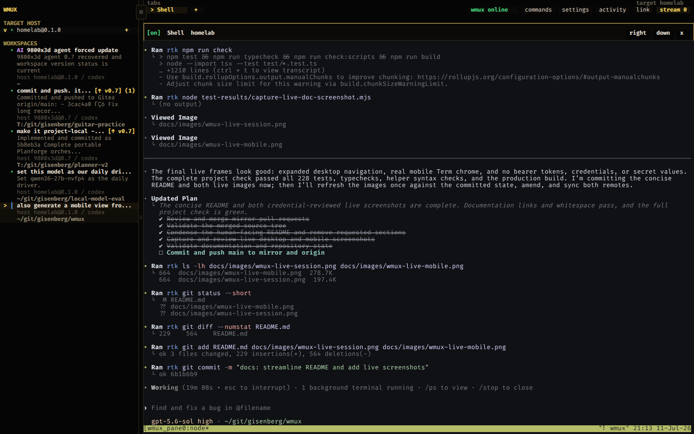
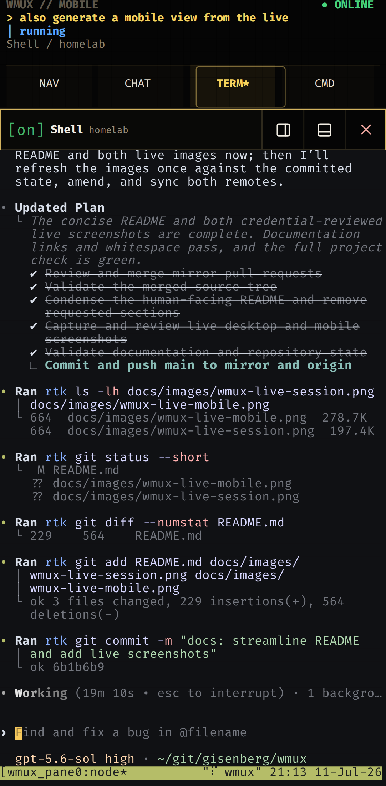
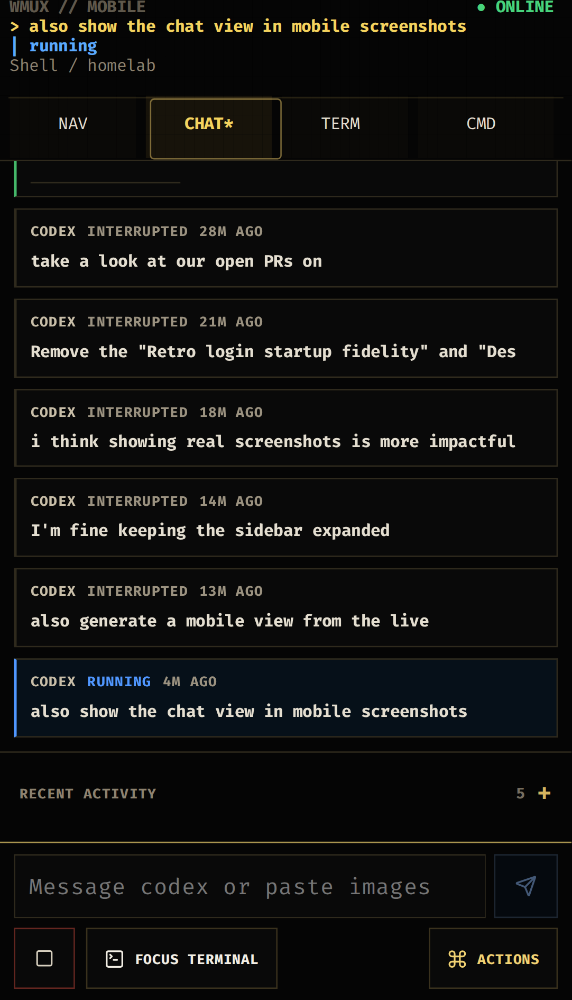

# wmux

[](https://github.com/gisenberg/wmux/actions/workflows/ci.yml)

A single-user browser terminal multiplexer for Tailscale and private networks.

wmux provides:

- local, SSH, PowerShell-over-SSH, and experimental Windows-agent terminals,
- durable workspaces, tabs, splits, activity, and direct links,
- `ghostty-web` terminal rendering with desktop and mobile controls,
- browser-aware clipboard, media, notifications, and screen streaming,
- static machine configuration or dynamic host registration.

> [!CAUTION]
> wmux grants terminal access to its machines. It is designed for one trusted
> user behind loopback, Tailscale, or another private network boundary—not the
> public Internet. Do not expose it through a public bind or unrestricted proxy.

## Screenshots

### Desktop



### Mobile

<p>
  
  
</p>

The desktop view and both mobile surfaces show the same live Codex workspace.

## Architecture

| Component | Responsibility |
| --- | --- |
| Browser client | React chrome, `ghostty-web` terminals, mobile controls, media, clipboard, and stream views |
| Node.js service | Private-network boundary, bearer authentication, REST API, event WebSocket, and canonical workspace state |
| Session manager | One live client per pane, bounded replay, VT checkpoints, resize ownership, and backend lifecycle |
| Machine catalog | Merges static `wmux.config.json` machines with dynamically registered heartbeat hosts |
| Execution backends | Local PTYs, SSH with `tmux`/`screen`, PowerShell over SSH, and the experimental Windows agent |
| Persistent state | Workspace layout, settings, attachments, and metadata under `~/.wmux` |
| Optional streaming | Machine-local MediaMTX capture or a Moonlight/Sunshine gateway, requested by the browser |

The server owns canonical workspace state and one live session client per
pane. Browsers are attachable views: refreshing or closing a browser does not
kill a pane, while explicitly closing a pane, tab, or workspace does. Execution
and capture remain on the target machine; the viewing browser does not provide
the terminal process or screen pixels.

## Quick Start

Requirements: Node.js 22+, npm, and a supported local PTY environment.

```bash
npm install
npm run build
npm run start -- --host 127.0.0.1 --port 3478
```

For development with Vite HMR:

```bash
npm run dev -- --host 127.0.0.1 --port 3478
```

To listen on Tailscale, use the machine's Tailscale IPv4 address:

```bash
npm run start -- --host 100.x.y.z --port 3478
```

wmux refuses wildcard and public bind addresses. It accepts loopback,
Tailscale `100.64.0.0/10`, RFC1918, and other explicitly supported internal
addresses.

For HTTPS, set both certificate paths and the browser-facing URL:

```bash
WMUX_CERT_FILE=~/.wmux/certs/wmux-host.tailnet.ts.net.crt \
WMUX_KEY_FILE=~/.wmux/certs/wmux-host.tailnet.ts.net.key \
WMUX_PUBLIC_URL=https://wmux-host.tailnet.ts.net:3478 \
npm run start -- --host 100.x.y.z --port 3478
```

HTTPS is required for browser secure-context APIs such as Moonlight/WebCodecs.

### User service and containers

Install or refresh the systemd user service with:

```bash
scripts/install-user-service.sh
```

It chooses the first Tailscale IPv4 address when available. Override it with
`WMUX_HOST`, `WMUX_PORT`, `WMUX_CERT_FILE`, `WMUX_KEY_FILE`, and
`WMUX_PUBLIC_URL`.

```bash
systemctl --user status wmux.service
systemctl --user restart wmux.service
journalctl --user -u wmux.service -f
```

For the non-root Compose deployment, see
[deploy/docker/README.md](deploy/docker/README.md).

## Machines

The checkout-local `wmux.config.json` is ignored by Git. Copy the public
template or use `~/.wmux/config.json`:

```bash
cp wmux.config.example.json wmux.config.json
```

```json
{
  "machines": [
    {
      "id": "linux-box",
      "name": "Linux Box",
      "kind": "ssh",
      "host": "linux-box.tailnet-name.ts.net",
      "user": "operator"
    },
    {
      "id": "windows-box",
      "name": "Windows Box",
      "kind": "powershell-ssh",
      "host": "windows-box",
      "user": "operator"
    }
  ]
}
```

- `WMUX_CONFIG_PATH` selects one explicit file and disables fallback.
- wmux adds the local machine unless `"localMachine": false` is set.
- Local and POSIX SSH machines default to `sessionBackend: "auto"`, preferring
  `tmux`, then `screen`; use `"pty"` to force a raw session.
- Use `kind: "powershell-ssh"` for Windows hosts reached from Linux or macOS.
  It requires OpenSSH Server and PowerShell 7 on Windows.
- Set `WMUX_ALLOWED_HOSTS` for non-`*.ts.net` MagicDNS or proxy hostnames.

Never commit machine inventories, credentials, tokens, private-key paths, or
personal service URLs. Windows setup is covered in
[docs/WINDOWS_NODE_REGISTRATION.md](docs/WINDOWS_NODE_REGISTRATION.md).

### Dynamic host registration

Remote hosts can register by heartbeat instead of appearing in static config.
The server creates a separate catalog-write credential at
`~/.wmux/registration-token`. Provision these files on the remote host with
mode `0600`:

```text
~/.wmux/url
~/.wmux/registration-token
~/.wmux/heartbeat.json
```

```json
{
  "machine": {
    "id": "linux-box",
    "name": "Linux Box",
    "kind": "ssh",
    "user": "operator",
    "sessionBackend": "auto"
  },
  "ttlMs": 90000
}
```

```bash
scripts/wmux-heartbeat --once
scripts/install-heartbeat-service.sh
```

Windows hosts use `wmux-windows-setup install-heartbeat` after their helpers
are staged. Run it as the Windows account that should own the logon-triggered
task; Task Scheduler access-denied failures exit nonzero instead of reporting
success. wmux always dials the validated heartbeat source address and removes
agent credentials from browser/status responses. Registered panes do not
receive the broad wmux API token, so API-posting helpers need separately
provisioned authorization.

## Authentication and Network Safety

Every API and WebSocket endpoint is token-gated in addition to private bind,
Host, and Origin checks.

- On first start, wmux creates `~/.wmux/token` and prints a one-time browser URL
  containing that token. Set `WMUX_TOKEN` or `WMUX_TOKEN_PATH` to supply one.
- Configure browser password login with
  `scripts/wmux-set-password --username you`. Login sessions last 30 days and
  survive restarts through `~/.wmux/session-secret`.
- `WMUX_DISABLE_AUTH=1` disables token checks only for deliberately isolated
  environments; it does not make public deployment supported.
- Use HTTPS away from loopback and treat every token as a password.
- Keep helper, clipboard, media, agent, and streaming endpoints behind the same
  private boundary. The Windows agent and Moonlight gateway use separate tokens.

Browser session tokens currently live in `localStorage`, WebSocket auth uses a
query parameter, and static helpers may receive a broadly privileged shared
token. wmux is not a hardened multi-user service.

## Workspaces and Interaction

- Workspaces contain linked tabs and draggable split panes.
- Agents using the bundled skill can create or reuse visible workspaces. These
  persist like user-created workspaces, appear with an `AI` badge, and retain
  direct links for monitoring or handoff.
- `/workspaces/:workspaceId/tabs/:tabId` opens a specific session directly.
- Workspace, tab, and pane selection are browser-local; terminal processes and
  notification read state remain server-owned.
- New same-host workspaces, tabs, and splits preserve the source pane's current
  directory through `tmux` metadata or OSC 7 reports.
- `wmux-title` updates generated titles without overwriting a manual title.
- Version indicators stay hidden unless a runtime or helper update is needed.
- Settings persist in `~/.wmux/settings.json` and include terminal size,
  scrollback, and user-facing host aliases.

Open the command palette with `Cmd/Ctrl+K` for navigation, host-scoped session
creation, splits, settings, diagnostics, activity, and session audit actions.

### Keyboard shortcuts

| Action | Shortcut |
| --- | --- |
| Command palette | `Cmd/Ctrl+K` |
| New workspace | `Cmd/Ctrl+N` |
| New tab | `Cmd/Ctrl+T` |
| Toggle sidebar | `Cmd/Ctrl+B` |
| Split right | `Cmd/Ctrl+D` |
| Split down | `Cmd/Ctrl+Shift+D` |
| Close tab | `Cmd/Ctrl+W` |
| Close workspace | `Cmd/Ctrl+Shift+W` |
| Workspace 1–8 / last | `Cmd/Ctrl+1–8` / `Cmd/Ctrl+9` |
| Tab 1–8 / last | `Alt+1–8` / `Alt+9` |
| Previous/next word | `Option/Alt+Left/Right` |
| Rectangular terminal selection | `Alt+Option+drag` (Linux Mint/Firefox primary); `Ctrl+Alt+drag` fallback, and bare `Alt+drag` may move the window |
| Focus neighboring pane | `Option+Cmd+Arrow` / `Alt+Ctrl+Arrow` |
| Latest unread notification | `Cmd/Ctrl+Shift+U` |

Browser- or OS-reserved shortcuts may not reach wmux on every platform.

## Helpers and Integrations

Local panes receive the repository's `scripts/` directory on `PATH`. SSH and
Windows panes stage matching helpers when a new pane starts.

| Helper | Purpose |
| --- | --- |
| `wmux-title` | Set generated or manual workspace/tab titles |
| `wmux-notify` | Create browser and terminal notifications |
| `wmux-agent-event` | Record agent lifecycle and response metadata |
| `wmux-run` | Track a command, duration, and exit status in Activity |
| `wmux-media` | Render images, audio, or video through the browser |
| `wmux-copy` / `wclip` | Hand text to the browser clipboard |
| `wmux-hooks` | Install Claude, Codex, or OpenCode lifecycle hooks |
| `wmux-doctor` | Report host, pane, and durability health |

Examples:

```bash
wmux-title --title "Auth Refactor" --descriptor "codex completed"
wmux-notify --title "Build" --body "Completed"
wmux-run -- npm test
wmux-media ./image.png
git diff | wmux-copy
wmux-hooks install opencode
```

`wmux-hooks install opencode` writes an auto-loaded global TypeScript plugin to
`${XDG_CONFIG_HOME:-~/.config}/opencode/plugins/wmux.ts`; it does not modify
`opencode.json`. POSIX installation is supported; Windows installer parity is not included.

OpenCode's semantic Copy action can write directly through OSC 52 (`ESC ] 52 ; c ; base64`). wmux
accepts only canonical UTF-8 write requests up to 1 MiB, removes every OSC 52 request from terminal
rendering, and never sends or persists its payload. Reconnect replay never writes the clipboard. Live
requests write automatically only in the focused foreground pane during a browser user activation;
otherwise the newest request is available as **Copy terminal request** in that pane's toolbar for 60 seconds.

The bundled Codex skill lives in `skills/wmux`:

```bash
mkdir -p "${CODEX_HOME:-$HOME/.codex}/skills"
ln -sfnT "$(pwd)/skills/wmux" "${CODEX_HOME:-$HOME/.codex}/skills/wmux"
```

Remote helpers are installed when a new pane starts; existing shells are not
retrofitted automatically.

## Experimental Windows Session Agent

Plain PowerShell-over-SSH panes do not survive a wmux service restart. The
optional Windows agent owns pane processes and replay independently:

```powershell
wmux-windows-setup install-deps
wmux-windows-setup install-agent
wmux-windows-setup agent-status
```

Opt in from the machine's untracked config:

```json
{
  "id": "windows-box",
  "kind": "powershell-ssh",
  "host": "100.64.0.30",
  "user": "operator",
  "sessionBackend": "agent",
  "agentPort": 3481,
  "agentToken": "replace-with-a-long-random-token"
}
```

Managed configs use `backend: "auto"`: ConPTY is preferred and terminal-safe
stdio is the fallback when `pywinpty` is unavailable. Existing explicit
`"conpty"` or `"stdio"` values remain pinned. To safely activate a staged
agent update while panes are open:

```powershell
wmux-windows-agent-service activate-update
```

The agent drains existing sessions and restarts after the last pane closes. A
forced agent restart still terminates its pane processes. See the
[Windows registration runbook](docs/WINDOWS_NODE_REGISTRATION.md) for setup and
validation.

## Persistence

wmux stores workspace layout in `~/.wmux/state.json` using versioned, atomic,
owner-only writes with a rolling validated backup.

| Backend | Survives browser refresh | Survives wmux restart |
| --- | --- | --- |
| Local/SSH `auto`, `tmux`, or `screen` | Yes | Yes |
| Raw PTY | Yes | No |
| Plain PowerShell-over-SSH | Yes | No |
| Windows session agent | Yes | Yes, while the agent remains running |

Each live pane also has bounded raw replay and an in-memory terminal checkpoint
for alternate-screen or truncated-history reconnects. Checkpoints do not
survive a wmux restart; durable multiplexers or the Windows agent redraw then.

Explicitly closing a pane, tab, or workspace kills its backing session. Audit
local wmux-owned multiplexer sessions with:

```bash
npm run audit:sessions
npm run audit:sessions -- --json
```

The Settings audit can remove confirmed duplicate or orphan wmux sessions but
never active or non-wmux sessions.

## Screen Streaming

wmux supports two machine-local streaming paths:

- MediaMTX plus `wmux-stream-agent` for on-demand, view-only WebRTC capture.
- A Moonlight/Sunshine gateway for browser-native interactive streaming.

```bash
scripts/install-stream-service.sh
wmux-stream-agent-service install
wmux-stream-agent-service status
```

Capture runs only while a browser holds a stream lease. macOS requires Screen
Recording permission; Windows capture should run through the per-user Scheduled
Task in the interactive desktop session. Keep RTSP, WebRTC, and gateway ports on
the private interface. See [docs/MOONLIGHT_GATEWAY.md](docs/MOONLIGHT_GATEWAY.md)
for Moonlight/Sunshine setup and security notes.

## Mobile

Phone-sized and short touch viewports use dedicated controls for navigation,
Chat, Term, and commands. The workspace drawer includes tabs and split panes;
only the active split is shown in the terminal area. Mobile overlays use
scrollable semantic controls, safe-area insets, and 44px touch targets. Chrome
collapses while the software keyboard is open without destroying the active
terminal session.

The Chat surface displays trusted structured agent events, not parsed PTY
output. Live terminal progress remains in Term view.

## Development

```bash
npm run typecheck
npm test
npm run check
npm run test:e2e
```

- `npm run check` runs unit/integration tests, both TypeScript checks, helper
  syntax validation, and the production build.
- `npm run test:e2e` exercises desktop Chromium plus phone-sized Chromium and
  WebKit against an isolated loopback-only service.
- `npm run test:e2e:chromium` is the faster browser subset.

See [AGENTS.md](AGENTS.md) for engineering constraints and the complete list of
known implementation gaps.

## Current Limitations

- wmux is single-user and private-network only.
- Machine management remains file-based; dynamic registrations have no UI.
- Linux and macOS session agents are not implemented. The Windows agent is
  experimental and does not preserve processes across its own restart.
- Dynamic registered panes need separately provisioned auth for helpers that
  post back to wmux.
- Kitty graphics support is partial; Sixel and iTerm2 image protocols are not
  implemented.
- Full-screen Windows app coverage and pixel-streaming automation remain works
  in progress.

## License

wmux-owned source code and artwork are available under the [MIT License](LICENSE).
Dependencies and historical assets retain their own terms; see
[THIRD_PARTY_NOTICES.md](THIRD_PARTY_NOTICES.md) and the provenance files beside
the assets.

Font files from Damien Guard's ZX Origins Micropack are used with permission
from Damien Guard and remain outside the MIT license. This attribution applies
to the font files, not the historical bitmap letterforms they represent.
